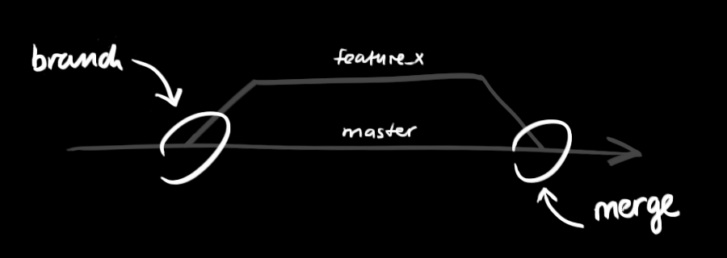

 GIT - GUIDE
====

[Git Help](https://help.github.com) | [Git Doc](https://git-scm.com/doc)

#### Create a new repository

    git init
    
#### Clone a repository

    git clone <URL>

#### Status

    git status
    git status -s // short version

#### Workflow
Your local repository consists of three "trees" maintained by git. 

 1. **Working Directory** *which holds the actual files.*
 2. **Index** *which acts as a staging area*
 3. **HEAD** which points to the last commit you've made. 
 

#### Add & Commit

    // Add it only to the Index
    git add <filename>
    git add *

    // Add it to the HEAD not in your remote repository
    git commit -m "Commit message"
    
    //To automatically stage files that have been modified and deleted
    git commit -a 

#### Pushing changes

    git push -u origin master // Only on the first commit
    git push origin master
    
If you have not cloned an existing repository and want to connect your repository to a remote server, you need to add it with:

    git remote add origin <server>

#### Branching
Branches are used to develop features isolated from each other. 

 - Master branch is the "default" branch when you create a repository

Create a new branch named "feature_x" and switch to it using

    git checkout -b feature_x

Switch back to master

    git checkout master

Delete the branch

    git branch -d feature_x

A branch is not available to others unless you push the branch to your remote repository

    git push origin <branch>

#### Update & Merge
To update your local repository to the newest commit

    git pull

To merge another branch into your active branch (e.g. master),

    git merge <branch>

Unfortunately, this is not always possible and results in conflicts. 
You are responsible to merge those conflicts manually by editing the files shown by git.
After changing, you need to mark them as merged with

    git add <filename>
   
   Before merging changes, you can also preview them by using

    git diff <source_branch> <target_branch>

#### Tagging
it's recommended to create tags for software releases. this is a known concept, which also exists in SVN. You can create a new tag named 1.0.0 by executing

    git tag 1.0.0 1b2e1d63ff
    
the 1b2e1d63ff stands for the first 10 characters of the commit id you want to reference with your tag. You can get the commit id by looking at the log

#### Log
See your recent commit history

    git log
	
	// You can add a lot of parameters
    git log --author=bob //  To see only the commits of bob
    git log --pretty=oneline // To see each commit is one line
	git log --name-status // To see only which files have changed

#### Replace local changes
Replace local changes using the command

    git checkout -- <filename>

In case you need to un-add any file

    git reset HEAD -- <file path>

To drop all your local changes and commits, fetch the latest history from the server and point your local master branch at it like this

    git fetch origin
    git reset --hard origin/master

Good Commit
----

### The seven rules of a great Git commit message:

 - Separate subject from body with a blank line
 - Limit the subject line to 50 characters
 - Capitalize the subject line
 - Do not end the subject line with a period
 - Use the imperative mood in the subject line
 - Wrap the body at 72 characters
 - Use the body to explain what and why vs. how

----------
### Short list of leading active verbs:

**Add** = *Create a capability e.g. feature, test, dependency.*

**Cut** *= Remove a capability e.g. feature, test, dependency.*

**Fix** = *Fix an issue e.g. bug, typo, accident, misstatement.*

**Bump** *= Increase the version of something e.g. dependency.*

**Make** *= Change the build process, or tooling, or infra.*

**Start** *= Begin doing something; e.g. create a feature flag.*

**Stop** *= End doing something; e.g. remove a feature flag.*

**Refactor** *= A code change that MUST be just a refactoring.*

**Reformat** *= Refactor of formatting, e.g. omit whitespace.*

**Optimize** *= Refactor of performance, e.g. speed up code.*

**Document** *= Refactor of documentation, e.g. help files.*
